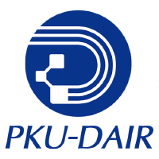

    
    <h1 align="center">⭐ Starter Guide ⭐</h1>
    
入门指南

    

        
        
    

本仓库为PKU-DAIR团队为相关领域的新人提供全面的开源文档和技术指南。通过汇集团队的核心论文和经验分享，将帮助初学者快速熟悉数据管理(Data Management, DM)和人工智能(Artificial Intelligence, AI)等前沿领域，搭建坚实的技术基础。无论你是刚入门还是希望加深理解，仓库中的资源将为你的学习和研究之旅提供有力支持。

## ✨ 科研入门指南

- Be disciplined, persistent, hard working, honest, and creative.

- Be familiar with your research area and read all the relevant papers from top conferences and journals.

- 📔 ["Crafting Your Research Future", Charles X. Ling and Qiang Yang](https://cuibinpku.github.io/resources/Crafting-Your-Research-Future.pdf)

- 📄 ["The Most Common Habits from English papers written by Chinese students", Felicia Brittman](https://cuibinpku.github.io/resources/chinese-english-problem.pdf)

- 📄 [Advice on how to succeed in graduate school", Marie desJardins](https://cuibinpku.github.io/resources/advice.pdf)

- 📄 ["Letter to research students" , Duane Bailey](https://cuibinpku.github.io/resources/research.pdf)

- 📄 ["Efficient Reading of Papers in Science and Technology", Michael J. Hanson](https://cuibinpku.github.io/resources/efficientReading.pdf)

- 📄 ["The Task of the Referee", A. J. Smith](https://cuibinpku.github.io/resources/reviewing-smith.pdf)

- 📄 ["How to do Research At the MIT AI Lab", MIT AI Lab](https://cuibinpku.github.io/resources/MIT-do-research.pdf)

- 🧑‍🏫 [科研入门指南--如何做好科研, 如何写好论文?](docs/tutorials/how_to_do_research.md)

- 🧑‍🏫 [如何读好学术论文?](docs/tutorials/Readme.md)

## 📑 研究方向

### AI系统方向 [🔗](docs/systems/Readme.md)

- [AI基础入门](docs/systems/Readme.md#AI基础入门)
- [ML/DL系统框架](docs/systems/Readme.md#ML/DL系统框架)
- [分布式训练](docs/systems/Readme.md#分布式训练)
- [LLM推理服务](docs/systems/Readme.md#LLM推理服务)
- [Diffusion（文生图、文生视频）推理服务](docs/systems/Readme.md#diffusion文生图文生视频推理服务)

### AutoML方向 [🔗](docs/autoML/Readme.md)

- [AutoML与超参数优化](docs/autoML/Readme.md#AutoML与超参数优化)
- [网络结构搜索(NAS)](docs/autoML/Readme.md#网络结构搜索(NAS))
- [模型压缩](docs/autoML/Readme.md#模型压缩)

### Database方向 [🔗](docs/database/Readme.md)

- [Classical Database System](docs/database/Readme.md#Classical-Database-System)
- [AI4DB](docs/database/Readme.md#AI4DB)
- [Vector database](docs/database/Readme.md#Vector-database)

### AI Agent方向 [🔗](docs/aiAgents/Readme.md)

- [Survey](docs/aiAgents/Readme.md#Survey)
- [Agent Planning](docs/aiAgents/Readme.md#Agent-planning)
- [Data Acquisition and Perception](docs/aiAgents/Readme.md#Data-acquisition-and-perception)
- [Actions/tool using](docs/aiAgents/Readme.md#Actions/tool-using)
- [Agent benchmark](docs/aiAgents/Readme.md#Agent-benchmark)

### Data-Centric ML方向 [🔗](docs/dcml/Readme.md)

- [ML数据侧入门+选方向](docs/dcml/Readme.md#ML数据侧入门+选方向)
- [Multimodal LLM](docs/dcml/Readme.md#Multimodal-LLM)
- [Multimodal & Alignment入门+选方向](docs/dcml/Readme.md#Multimodal-&-Alignment入门+选方向)
- [RAG](docs/dcml/Readme.md#RAG)

### 扩散模型方向 [🔗](docs/diffusion/Readme.md)

- [扩散模型基础](docs/diffusion/Readme.md#扩散模型基础)
- [扩散模型加速](docs/diffusion/Readme.md#扩散模型加速)
- [文生图/视频](docs/diffusion/Readme.md#文生图/视频)
- [3D/4D生成](docs/diffusion/Readme.md#3D/4D生成)

### AI for Science方向 [🔗](docs/science/Readme.md)

- [蛋白质建模](docs/science/Readme.md#Protein)
- [小分子建模](docs/science/Readme.md#Small-molecule)

### Graph方向 [🔗](docs/graphs/Readme.md)

- [GNN basics](docs/graphs/Readme.md#GNN-basics)
- [Heterogeneous GNN](docs/graphs/Readme.md#Heterogeneous-GNN)
- [Graph condensation](docs/graphs/Readme.md#Graph-condensation)
- [Homogeneous](docs/graphs/Readme.md#Homogeneous)
- [Graph condensation](docs/graphs/Readme.md#Graph-condensation)
- [Heterogeneous](docs/graphs/Readme.md#Heterogeneous)
- [Graph Structure Learning](docs/graphs/Readme.md#Graph-Structure-Learning)
- [Graph Data Augmentation](docs/graphs/Readme.md#Graph-Data-Augmentation)
- [GNN System](docs/graphs/Readme.md#GNN-System)
- [GNN+LLM](docs/graphs/Readme.md#GNN+LLM)
- [GNN 数据标注](docs/graphs/Readme.md#GNN-数据标注)
- [Scalable GNN (GNN Acceleration)](docs/graphs/Readme.md#Scalable-GNN-(GNN-Acceleration))

Copyright © 2024 by PKU-DAIR. All rights reserved
